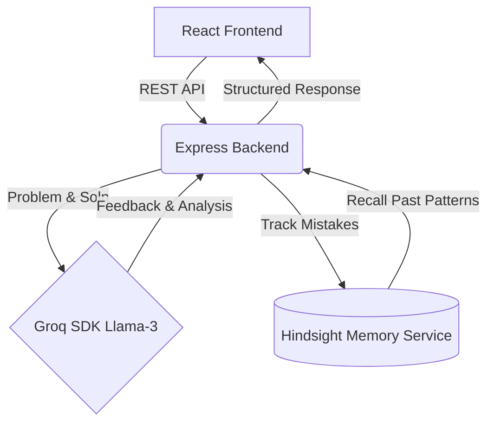

# Cognitive AI Coding Mentor 🧠💻

An intelligent, full-stack AI coding mentor application that provides personalized coding guidance, tracks historical mistakes, and scales feedback difficulty based on user improvement over time. 

Built for hackathons and continuous learning, this platform bridges the gap between static tutorials and human mentors by using advanced LLMs (Groq) and long-term memory (Hindsight) to create a deeply personalized learning experience.

## ✨ Key Features

- **Personalized Mentorship:** Uses Groq to provide feedback with tailored debugging hints, code analysis, and learning paths.
- **Adaptive Memory (Hindsight):** Remembers past coding mistakes and categorizes them (e.g., Logic Errors, Syntax, Edge Cases). Adapts the difficulty of challenges based on the user's progress.
- **Dual Workspace Support:**
  - **Mentee Workspace:** Submit code, view feedback, chat with AI/human mentors, and track personal growth.
  - **Mentor Workspace:** Review requests, handle mentorship queues, and communicate directly with mentees.
- **Real-time Analytics:** Visualizes mistake "DNA" and confidence progress via Recharts.
- **Micro-Challenges:** AI-generated 5-minute challenges targeting the user's specific weak points.
- **Dynamic UI:** Modern glassmorphism UI with smooth animations, dark-mode styling, and responsive layouts.

## 🛠️ Tech Stack

**Frontend:**
- React 19 (Vite)
- React Router DOM
- Recharts (for Analytics/Progress tracking)
- CSS3 (Vanilla + Glassmorphism capabilities)

**Backend:**
- Node.js & Express.js
- Groq SDK (LLM integration via `llama-3.3-70b-versatile` for lightning-fast AI analysis)
- Vectorize Hindsight Client (for complex, context-aware memory tracking)
- CORS & Dotenv

## 🏗️ System Architecture



## 🚀 Getting Started

### Prerequisites
- Node.js (v18+ recommended)
- A [Groq API Key](https://console.groq.com/)
- (Optional) A local or remote Vectorize Hindsight instance

### 1. Clone & Install Dependencies

```bash
# Install backend dependencies
cd backend
npm install

# Install frontend dependencies
cd ../frontend
npm install
```

### 2. Configure Environment Variables

Navigate to the `backend` directory and copy the example `.env` file:

```bash
cp .env.example .env
```

Fill in your `GROQ_API_KEY` and `HINDSIGHT_API_KEY` inside `.env`.

### 3. Run the Application

You will need two terminals to run both the frontend and backend servers.

**Terminal 1 (Backend):**
```bash
cd backend
npm run dev
# or: node server.js
```

**Terminal 2 (Frontend):**
```bash
cd frontend
npm run dev
```

Visit `http://localhost:5173` in your browser.

## 📝 Usage Highlights

1. **Login System:** Simple profile-based login tracking whether you want to act as a **Mentee** or **Mentor**.
2. **Submit Code:** Paste your problem and your solution. The AI will classify your errors and give you a structured path to improvement.
3. **Dashboard:** View your learning trajectory, total mistakes, and improvement rate over your sessions.
4. **Mentor Matching:** AI automatically recommends suitable human mentors based on your weak coding areas!

## 🤝 Contributing
Contributions, issues, and feature requests are welcome! Feel free to check the issues page.

## 📄 License
This project is [ISC](https://opensource.org/licenses/ISC) licensed.
